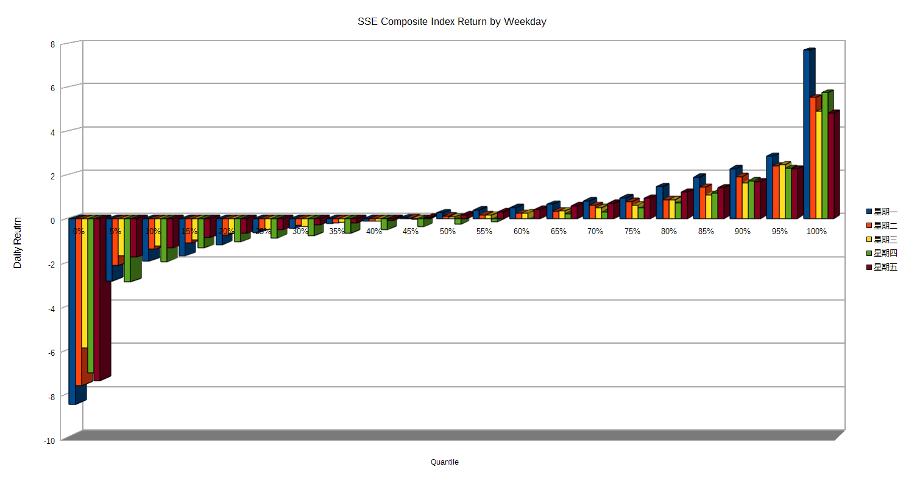

# Stock Return in SSE Composit by Weekday using R

## Objective
Confirm that the stock return for Thursday is lower than other weekdays, maybe because liquidity operations by Central Bank.

## Script Logistics
1. get data from Yahoo! finance
2. get daily percentage return with Delt()
3. store weekday and p.change data in data.container
4. get mean return for each 5% quantile for each weekday suing by()
5. output data and plot using Libre Calc

## Results

- Monday seems to be more volatile than other weekdays(more likely to outperform in good times and underperform in bad)
	- We see largest rise and plunge in Mondays
- For the first 5%-80% Thursday seems to have larger drop than other weekdays

## TODOs(maybe)
- Although the conclusions above are obvious and illustrative from the figure, stats and p-values can be added
- Script can not work for R with other timezone and localizations
